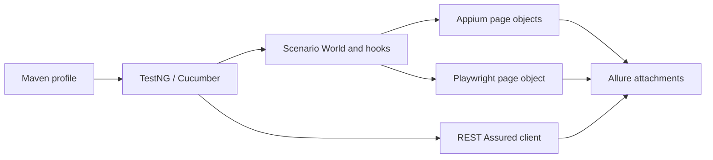

# Framework notes

## Structure

The project has separate mobile, web and API packages in one Maven build. Appium drives Android, Playwright Java drives the browser, and REST Assured calls the API. TestNG runs the Cucumber scenarios, with results and attachments in Allure.

Page objects hold selectors and reusable interactions. PicoContainer creates a new `World` for each scenario. Hooks start and close sessions and capture screenshots. Drivers and API responses belong to the scenario that created them.

The default Maven command runs four local API contract tests. Profiles select the web, live API, normal mobile or crash suite.

Mobile tests run sequentially on one device. Web scenarios use separate browser contexts; CI runs each browser in its own job. When Firefox needs a custom CA, each scenario gets a temporary profile with the certificate databases, which is deleted after shutdown.

## Test checks and waits

Web tests check the selected items, complete descending sort order, both rental forms, today's date, resized dimensions and all three green backgrounds. Book Now is a demo control, so the test checks the selected form values rather than a booking transaction.

Android uses explicit waits with zero implicit timeout. Registration checks the defaults and all six confirmation values. Toast checks use short XPath polling with Android idle waits temporarily disabled. Popup checks use multi-window accessibility.

The API POST test first fetches user 10 and uses the returned `first_name` as its name, with job `BA`. API checks cover status, returned values, ID, schema and timestamp. Local contract tests also cover a missing source user, blank job and malformed response.

## WebView compatibility

The API 28 image uses Chrome 69. UiAutomator2 3.9.9 and ChromeDriver 2.44 support that WebView's protocol.

MOB-03 uses DOM IDs/names and Selenium Select because Android reports stale bounds after the result page changes height. It checks the reset URL, default name and Volvo selection, then restores `NATIVE_APP` in `finally`. Appium installs a copy of the supplied APK to keep the original file unchanged.

## Crash tests

MOB-08 and MOB-09 trigger the app's two deliberate crashes. The home-title check then fails, and the suite returns a nonzero exit code.

Typing into the crash field can raise `StaleElementReferenceException` as the app exits. The trigger accepts this only if the app has left home; otherwise it rethrows the exception. Failure reports include screenshots, page source and AndroidRuntime logs.

The [coverage table](coverage.md) lists the checks for each scenario. Results are in [test results](execution-record.md).
