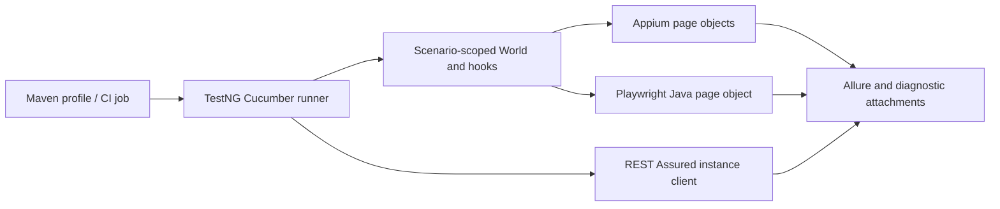

# Framework notes

## Suite boundaries and lifecycle

One Java Maven project contains separate mobile, web and API packages. Appium handles Android, Playwright Java handles browser interactions, and REST Assured handles HTTP requests. TestNG executes Cucumber scenarios; Allure records results and attachments.

Page objects contain selectors and reusable page interactions. PicoContainer creates a separate World for each scenario. Lifecycle hooks release resources even when evidence capture fails. Drivers and responses are not shared through mutable global state.

Default tests run four local HTTP contracts. Maven profiles select live suites. The API POST scenario performs a fresh GET, maps user 10's `first_name` to `name`, and uses configured job `BA`. The assessment's illustrative Bryant value is not used as a fixed name.

Mobile executes sequentially on one device. Browser contexts are isolated, and CI browser jobs use separate workers to respect Playwright thread ownership.

## Assertions and synchronization

Web coverage checks the exact selected subset, complete descending order, both pictured rental forms, current date, rendered size changes and all three green RGB values. Book Now has no booking backend; its checks cover UI state.

Registration checks defaults and all six confirmation values. Native waits use explicit timeouts and zero implicit timeout. Toast polling initializes XPath before the trigger and temporarily disables Android idle waits. The WebView dropdown and popup use multi-window accessibility. Tests do not use blanket retries or fixed sleeps.

API assertions cover HTTP status, user identity, echoed values, nonblank ID, response schema and timestamp. Local negative checks reject missing source users, blank jobs and malformed response contracts.

## APK compatibility and crash cases

The supplied APK has no WebView debugging support. The Hello form is exercised through native accessibility controls. Appium installs a disposable copy to preserve the original APK and checksum.

The two deliberate crash cases retain the failing home-title assertion. A synchronous text-trigger crash can raise `StaleElementReferenceException` during `sendKeys`; the trigger catches that exception only when the app has left home. If home remains active, it rethrows the exception. Screenshots, native source and AndroidRuntime logs accompany the failure results.

MOB-03 remains unresolved: submitted values pass, but the reset link is clipped on the tested emulator. Native scrolling and usable-bounds waits retain the original reset assertions. No forced navigation or XML-bounds workaround is used. Results and diagnostic conditions are in the [execution record](execution-record.md).

## Scope

The assessment covers nine Android scenarios, seven web scenarios and two live API scenarios. The [coverage matrix](coverage.md) maps each requirement to its checks. The four local contracts supplement live API coverage.

Manual testing uses the permitted Spartoo responsive website and records three reproduced findings in Excel. Native Android/iOS manual testing, transactional flows, production performance/security testing and a full assistive-technology audit are outside this execution scope.
