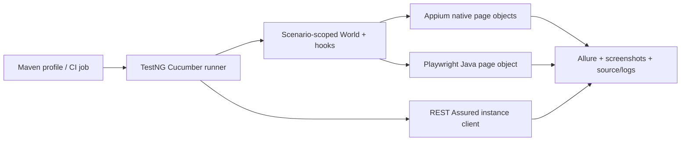

# Submission review and design defence

## Design decisions

One Java Maven project keeps the assessment's required languages and dependencies consistent. Appium owns Android, Playwright Java owns browser interactions and REST Assured owns HTTP requests. Domain page objects contain selectors and observable assertions; Cucumber steps describe intent. PicoContainer creates a separate World for each scenario, and lifecycle hooks close resources even when evidence capture fails. TestNG executes Cucumber; Allure records its scenarios and attachments.

The defaults run four independent local HTTP contract checks. External suites require explicit profiles so an offline build cannot be mistaken for live assessment coverage. API scenarios do not depend on execution order. The POST scenario performs its own GET prerequisite and maps user 10's first_name to the POST name; the illustrative Bryant name is not silently hard-coded.

Mobile runs sequentially on one device. Browser contexts are isolated. CI browser jobs run in separate workers rather than sharing Playwright objects across threads. Deliberate crash cases produce genuine failures in a separate profile; an expected app crash is not converted into a passing home-screen assertion.

## Critical review

- All required scenarios have dedicated feature tags. Both pictured Controlgroup forms are covered; there is no invented booking backend assertion.
- Mobile registration asserts defaults and every confirmation field. Web sorting verifies the complete ordered list, selection verifies the exact subset, and RGB checks cover all three widgets.
- API checks assert status, user identity, echoed values, generated ID and response schema. Local negative tests reject missing source users, blank jobs and malformed response contracts.
- No arbitrary test sleeps, blanket retries, static drivers, global REST Assured state or exception-to-pass conversion. Toast polling and Android service startup waits have explicit limits.
- Secrets remain outside source and reports. Proxy/TLS verification stays enabled. APK integrity is checked; Appium installs a disposable copy.
- The legacy APK does not expose a debuggable WebView. Accessibility controls are exercised and their visible result is asserted. This is a specific compatibility decision, not a claim that WebView context switching was verified.
- Evidence and execution records distinguish failed investigations, successful reruns, intentional failures and unrun CI/browser combinations. A zero-scenario tag mistake during diagnosis is excluded from validation evidence.

## Limits to discuss honestly

Live public sites and Reqres can change or rate-limit requests. UI assertions intentionally describe the supplied demo, rather than generalising to a production booking system. The mobile APK is old and Android compatibility behaviour depends on the emulator image/display configuration. This cloud host has no KVM and uses a slower software emulator. Firefox could not be validated on this restricted host; the CI matrix needs an actual GitHub Actions run before claiming Firefox success.

The manual workbook reports three reproduced browser observations. The unmatched-search finding has a product-intent qualification: intentional fallback still needs an explanation. Cookie focus and skip-link observations establish the recorded keyboard failures; they do not claim a full screen-reader or legal compliance audit. Payments, account creation, financial transactions and destructive operations were excluded.

## Final interview rehearsal

Start with the architecture and suite boundaries, demonstrate the live API chain, then one browser scenario and registration. Show a failed crash result with its screenshot/log evidence and explain why its job stays red. Open the manual workbook and reproduce the skip-link issue. Be ready to explain waits, locator choices, state isolation, negative coverage, schema limits, timezone, compatibility constraints, external-site instability and why adding test count alone would not improve risk coverage. See the [question guide](interview-guide.md).

## Unresolved weakness

MOB-03 is implemented but not validated as passing. This is a material execution gap, not a cosmetic note. Keep it visible in the report and explain the confirmed submission assertions, clipped reset-link bounds, unsuccessful scroll diagnostics and next device/emulator check. Do not defend this as an expected crash failure or remove the reset assertion to obtain a green build.
